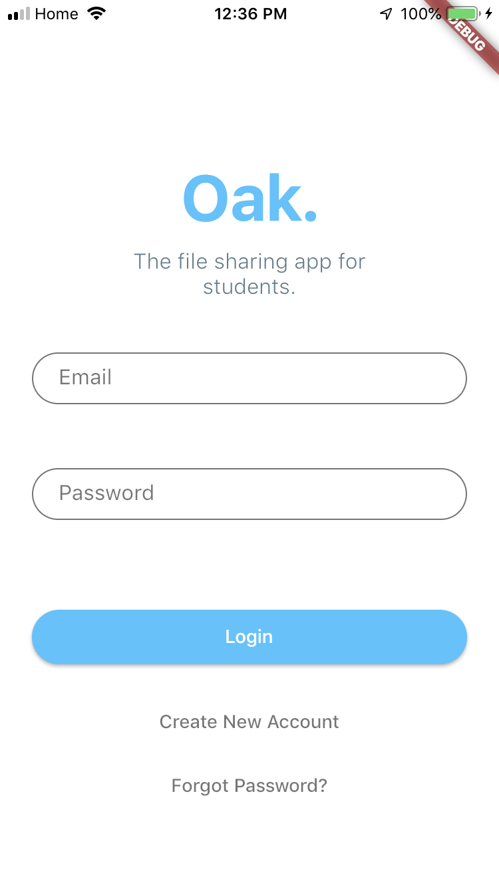

# Oak

## Introduction
Let's face it. As a student one of the hardest challenges we face is finding quality notes for our classes. If we miss a class if we have our friends send us notes, or if we are lucky they are posted online. 

## The App
Noted is a platform where students can both share and read notes posted by other students. You can sign up and have access to other students notes from classes as well as any study materials. When you post notes, you are rewarded with tokens which you can use to purchase the right to view other peoples notes. The tokens you earn can be used to view notes from any of your classes, meaning that if you post notes for a math class, the tokens you earn can be used to view any other class you wish. 

### Core Features
- Ability upload and view files.
- Token system 
- Authentication and Validation
- Subscribe to any class and be informed when a students posts a set of notes
- Preview notes
- Rating system 
- Notifications

### PRE-PHASE I: Planning and Learning
Initially, we need to decide what the final state of the app will look like. This means deciding on core features, the user interface and the planning out what steps need to be taken. Flutter, a framework developed by Google will be used to create our app. This was chosen in order to give us acess to a unified codebase that would result in the fasted development time.

For the  user interface, simple pen on paper mockups will be used to draw layouts for each page of the app. We are going to need a couple pages which navigate to others.

- Main/Featured: Shows a list of cards with notes. Top bar has button to access settings and a navbar at the bottom to navigate to search and upload. Shows user how many tokens then have.
- Search: Allows you to search for notes. Will navigate back to main page when query is made.
- Upload: Uploads notes, navigate to main page when upload complete.
- Settings: Allows user to edit account info.
- Transaction: Allows user to purchase tokens. Returns to main screen when transaction complete.
- Card: Allows user to interact with selected file.
- Login: Allows user to log into application.

We also have a couple components that will need to be reused throughout the app, mainly:
- Navbar: Exists on MainScreen, SearchScreen, UploadScreen

### PHASE I: User Interface
Using the outline of the features above, the first step in this project is to create a basic user interface that models the functionality of the app. This will not have a connection to a backend database, nor any authentication/notification system. 

### PHASE II: Uploading and File Viewing System
For this app to be successful, the user must have a easy to use and intuitive note viewing system. This comes in two parts, the uploading of notes and the viewing of other peoples notes. The uploading portion will use the users camera on their smartphone to initially take pictures of the notes. Then, by using a combination of a report/rating system and Google's Cloud machine learning platform we can reduce the risk that files other than notes are uploaded. A user will be able to save notes, view a preview of them and purchase the rights to view them for tokens.

### PHASE III: Authentication and Validation
Initially, email/password validation would be the most straightforward type of authentication. Later authentication via facebook and google would also be nice to have.
